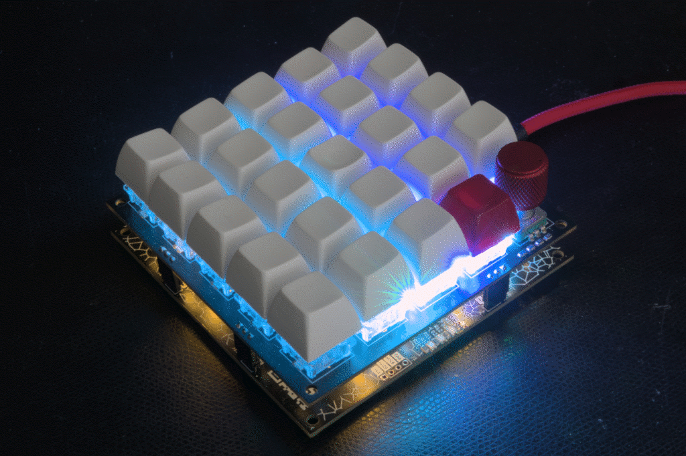

5x5x2 aka Orochi!
=================

This is a 5x5 Cherry mx matrix with hotswap Kailh sockets based my own
firmware for the STM32F1 with libopencm3. The project contains
firmware, schematics and a board layout in kicad.

Features you expect given the above picture:
- bios boot and nkro keyboards, using usb keyboard scancodes
- system and consumer codes
- mouse events
- usb serial interface for configuration
- 8 sk68xx background leds on the bottom board
- 25 sk68xx underglow leds on the top board
- rotary encoder

Advanced features:
- adjustable speed macrokeys to e.g. emit passwords
- all leds individually addressable, colorchord support
- leds can light on e.g. volume or desktop changes
- configuration can be adjusted and flashed in userflash
- and an automouse that can simulate fast clicking

More pictures of the board and the development dongle are
[here](docs/IMAGES.md). If you want to build this yourself see
[building](docs/BUILDING.md). Interactive bom is
[here](https://glcdn.githack.com/dijkstrw/5x5x2/-/raw/30abe2597a5d5bfca67bad37a444652a956d1f03/schematic/bom/ibom.html).

Default firmware / my usecase
-----------------------------

This is my macropad; it contains three layers:

- X workspace layer, select workspace number, move about in VLC, start
  apps, compose key, quick jump to password layer and a number of app
  starting keys. Rotary dial controls system volume. Rotary press
  mutes/unmutes.

  Rgbleds show sound volume, current workspace / screen and active
  layer.

- numeric keypad, for when tkl is not enough

- macrokeys layer

Features
========

Keyboards
---------

The board provides 3 types of keyboards via different usb
endpoints.

1. The first is the usb standard bios keyboard definition, which
   allows the keyboard also to emit key codes to hosts with limited
   usb hid support. (This used to be the case in <2015 style bioses,
   hence the name.)

2. The second keyboard is a n-key-rollover, which exposes a keyboard
   that allows 224 usb keyboard scancodes to be pressed
   simultaneously. Also, because we do not need to adhere to the bios
   boot standard, this endpoint's interval can set much lower = it
   types much faster.

3. The third keyboard can emit so called consumer and system
   codes. Example consumer key codes are PLAY, PAUSE, but also MARK,
   CLEARMARK, REPEATFROMMARK. So everything the typical multimedia
   keys emit and then some.

Mouse
-----

Operate the rodent from your keyboard! There is support for x, y, 5
buttons and a vertical and horizontal scrollwheel action.

Serial
------

The board exposes a serial port for logging and
configuration. Configuration is done using commands, with these
general rules:

- Commands with lowercase letters request configuration information

- Commands with capital letters set configuration

- Arguments often are two hexadecimal digits long; e.g. ``00``,
  ``12``, ``fa``. If more digits are required, this is denoted in the
  argument specification by a colon, like so ``<argument:4>``.

The available commands are:

    ?  - show a terse description of available commands.

    i  - show usb info strings; contains the git-describe tag of the
         current firmware.

    d  - dump configuration of a named subsystem, see below.
    dg - dump the keymap light group
    dk - dump the keymap
    dp - dump the palette
    dr - dump the rotary configuration

    B  - set the bottom set of 8 leds (backlight) to custom rgb values.
         Takes a RGB argument of the form <rgb:6> times 8 for all leds.

    C  - set the top set of 25 leds (frontlight) to custom rgb values.
         Takes a RGB argument of the form <rgb:6> times 25 for all leds.

    D  - tell keyboard about an event that can be translated into a rgb
         light event, see below.
    DD - <screen><display> set current desktop display
    DM - <mute>            set sound output mute status
    DR - <mute>            set sound input/record mute
    DV - <volume:4>        set sound volume
         See config directory for a program that emits these events to the
         keyboard.

    G  - set light map for a key, takes argument of the form
         <layer><row><column><value>

    I  - set the rgb light intensity.

    K  - redefine a key in the keymap, takes argument of the form
         <layer><row><column><type><arg1><arg2><arg3>

    A  - clear all macro keys.

    M  - define one macro key, takes an argument of the form
         <number><oftenusedstring>. The number is a two hexdigits, the
         string can be upto 32 7-bit ascii chars long and is terminated
         with a newline.

    N  - set keyboard mode to <argument>; 00 for bios and 01 for nkro.
         Default is bios.

    P  - set palette color, takes arguments
         <number><hue:4><saturation><value>

    R  - redefine the rotary command, takes a argument of
         the form <layer><direction><type><arg1><arg2><arg3>

    L  - load configuration from flash

    S  - save configuration to flash

    Z  - clear the configration flash, revert to "factory" keymap at
         next powerup.

Command interpretation starts after receiving a newline.

Light events
------------

The keyboard will show desktop events as rgbled changes. This works in
a number of steps:

- There is a host program that connects to the serial port, monitors
  sound and workspace changes and communicates that back to the
  keyboard. The program can be found in
  [susanoo.py](config/susanoo.py). Note that workspace changes sent
  via a fifo using the desktop manager and
  [configuration](config/keys_orochi.lua).

- Incoming events are mapped to be shown on particular leds using the
  lightmap command.

- The events all have their own displays:

         B - backlight    - slow rainbow easing
         D - desktop      - desktop display mapped over palette
         L - layer        - layer mapped over palette
         m - macro        - if macro active, else backlight
         M - sound mute   - different colors for mute status
         V - volume       - volume mapped to color

Palette
-------

Colors in easings are assigned using a color index in the palette. The
default palette strives for a selection of colors that are visually
distinct from another.

The rotary action forward, backward and backlight colors have fixed
indexes, and can be set by adjusting their assigned palette colors.

Automouse
---------

Automouse is a mouse clicker, with optional speed setting and wiggle
amounts. This allows you to click real fast, and wiggle the mouse
while using your hands for something else.

Macros
------

Macros set via serial are lost at power off unless the configuration
is written to flash. Loading from flash happens automatically at
powerup.

The strings that you provide via serial need to be translated into usb
keycodes, so currently only 7-bit ascii strings are supported.

Setting macros via the shell is easy:

    echo -e "\nM01Nevergonnagiveyouup!\n" > /dev/ttyACM0

Or see [set_macro.sh](util/set_macro.sh).

Notes:

- The initial newline is a trick to make sure our M will be considered
  the start of a command, no matter what has been put to the serial
  before by you, some driver or the os.
- This particular example defines the macro for macro key number 1.
- You need to have a macro key 1 in your keymap, otherwise you have
  nothing to trigger the macro.
- There is intentionally no way to display stored macros.
